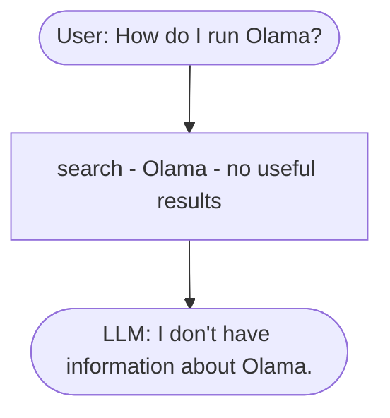
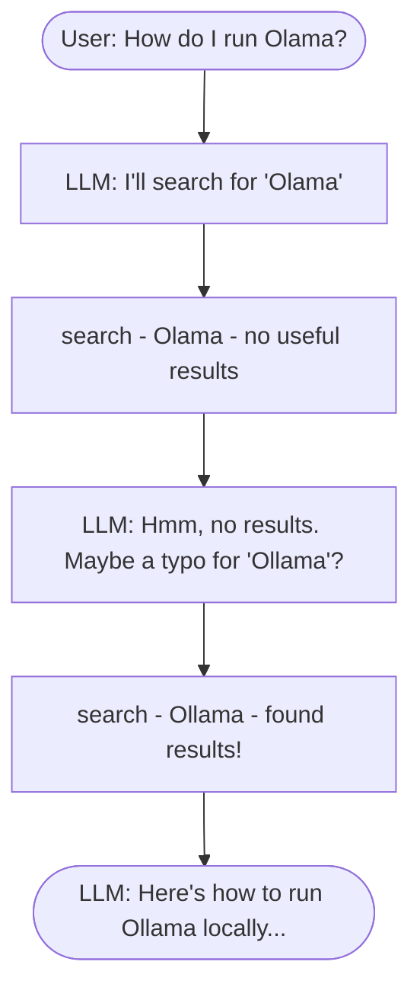

[LLM Zoomcamp](/course-wiki/llm-zoomcamp/) › [Module 1: Agentic RAG](/course-wiki/llmz-module-01/) › Function Calling

## Notes

---
video_url: "https://www.youtube.com/watch?v=CeEki_0mdGo&list=PL3MmuxUbc_hLZFNgSad56pDBKK8KO0XIv"
---
# Function Calling

In the previous lesson we built a RAG pipeline with `RAGBase.rag()`
and saw it fail on the "Olama" typo. The search returned nothing
useful, and the LLM had no way to recover.

The flow that broke:



The pipeline is fixed: search, build prompt, LLM.

```python
def rag(self, query):
    search_results = self.search(query)
    prompt = self.build_prompt(query, search_results)
    answer = self.llm(prompt)
    return answer
```

The LLM is a passenger here, not a driver. It never sees the bad
search results, so it can't try again with a corrected query.

## The agent alternative

An agent puts the LLM in charge.

Instead of running search ourselves, we give the LLM a `search` tool.
It decides when to call it and what to search for.

The same typo question now goes like this:



The LLM searched, saw the results were bad, and decided to try again
with a different query. It made that decision on its own. We didn't
write any code to handle typos.

The difference is about who makes the decisions:

- With RAG, the developer decides. We fix the steps up front, so
  search always runs once with the exact user query.
- With an agent, the LLM decides. It chooses which actions to take
  and when to stop.

The mechanism that makes this possible is function calling, and that's
what the rest of this lesson is about.

## Asking without tools

First, let's see what the LLM does without any tools. We ask it a
course-specific question and look at the answer.

```python
messages = [
    {"role": "user", "content": "I just discovered the course. Can I join it?"}
]

response = openai_client.responses.create(
    model="gpt-5.4-mini",
    input=messages,
)

response.output_text
```

The model answers from its general knowledge, something like "it
depends on the course" or "check the course website". It doesn't know
about our FAQ, so the answer is vague and not helpful. This is exactly
why we need RAG, and why we want to hand the model a tool.

## Defining the tool

First we define a top-level `search` function that queries the `index`
directly. The model will reference it by this name. We keep the Python
function and the tool name aligned so the dispatch is easier later.

```python
def search(query):
    boost_dict = {"question": 3.0, "section": 0.5}
    filter_dict = {"course": "llm-zoomcamp"}

    return index.search(
        query,
        num_results=5,
        boost_dict=boost_dict,
        filter_dict=filter_dict
    )
```

Next we tell the model about this function. The model doesn't see our
Python code, only a schema describing what the function does and what
arguments it takes. LLMs are language agnostic. At the end we're just
making an HTTP call, so we describe the tool in JSON rather than in
Python. The same schema would work from TypeScript or Java.

```python
search_tool = {
    "type": "function",
    "name": "search",
    "description": "Search the FAQ database for entries matching the given query.",
    "parameters": {
        "type": "object",
        "properties": {
            "query": {
                "type": "string",
                "description": "Search query text to look up in the course FAQ."
            }
        },
        "required": ["query"],
        "additionalProperties": False
    }
}
```

The `description` is the most important field, because the model reads
it to decide when to call the functio

## Key concepts

- [Function Calling](/course-wiki/function-calling/)
- [Agentic RAG](/course-wiki/agentic-rag/)

## Related notes

- [llmz-m01-agents](/course-wiki/llmz-m01-agents/)
- [llmz-m01-building-the-prompt](/course-wiki/llmz-m01-building-the-prompt/)
- [llmz-m01-data-ingestion](/course-wiki/llmz-m01-data-ingestion/)
- [llmz-m01-environment](/course-wiki/llmz-m01-environment/)
- [llmz-m01-introduction](/course-wiki/llmz-m01-introduction/)
- [llmz-m01-other-frameworks](/course-wiki/llmz-m01-other-frameworks/)
- [llmz-m01-quick-rag-revision-optional](/course-wiki/llmz-m01-quick-rag-revision-optional/)
- [llmz-m01-rag](/course-wiki/llmz-m01-rag/)
- [llmz-m01-rag-helper](/course-wiki/llmz-m01-rag-helper/)
- [llmz-m01-search](/course-wiki/llmz-m01-search/)
- [llmz-m01-the-agentic-loop](/course-wiki/llmz-m01-the-agentic-loop/)
- [llmz-m01-the-course-faq-dataset](/course-wiki/llmz-m01-the-course-faq-dataset/)
- [llmz-m01-the-llm](/course-wiki/llmz-m01-the-llm/)
- [llmz-m01-toyaikit](/course-wiki/llmz-m01-toyaikit/)
- [llmz-m01-wrap-up-of-part-1](/course-wiki/llmz-m01-wrap-up-of-part-1/)
- [llmz-m03-ai-agents](/course-wiki/llmz-m03-ai-agents/)
- [llmz-m04-evaluation](/course-wiki/llmz-m04-evaluation/)

## Sources

- [Video](https://www.youtube.com/watch?v=CeEki_0mdGo&list=PL3MmuxUbc_hLZFNgSad56pDBKK8KO0XIv)
- [Lesson file](https://github.com/llm-zoomcamp/blob/main/llm-zoomcamp/cohorts/2026/01-agentic-rag/13-function-calling.md)
